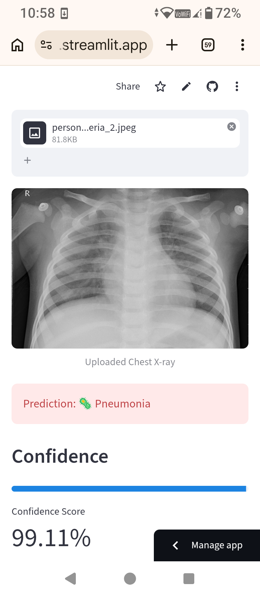
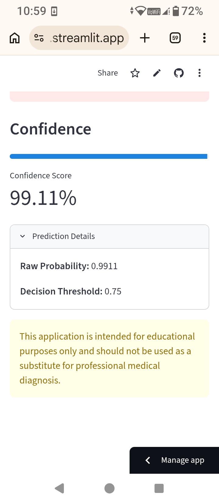
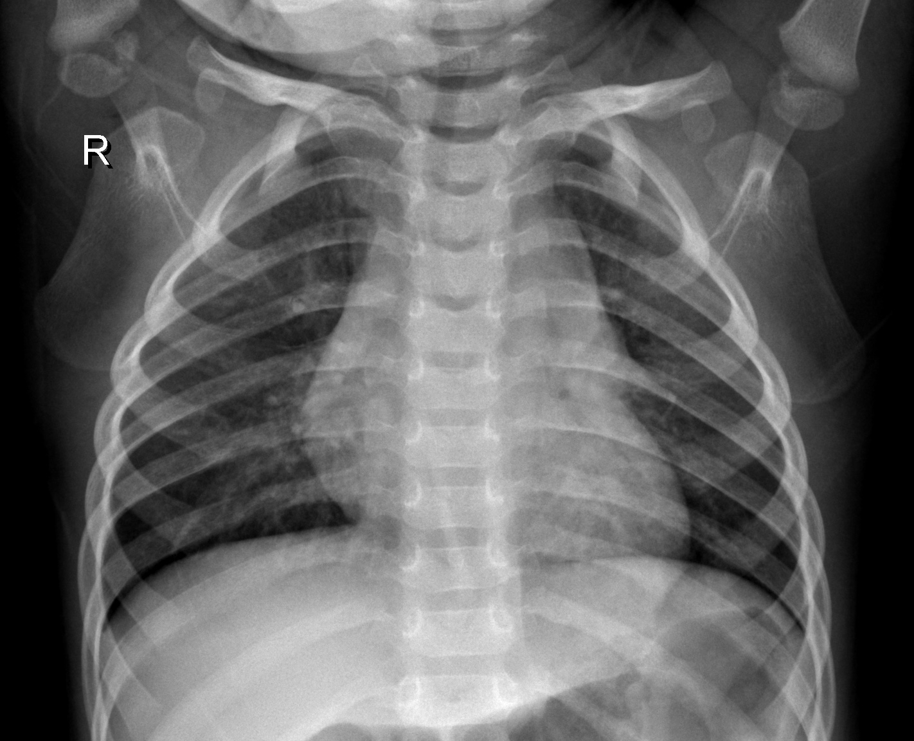
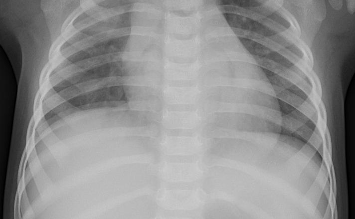

# 🫁 LungVision-AI

An end-to-end Deep Learning project that detects **Pneumonia** from pediatric chest X-ray images using **Transfer Learning with ResNet18** and **PyTorch**.

> This project was built to gain practical experience with the complete Computer Vision workflow—from data preprocessing and model training to deployment as an interactive web application.

---

# 🚀 Live Demo

**Try the application here:**

🔗 https://lungvision-ai-gabksershqno8fndaxk6pj.streamlit.app

---

# 🎯 Project Goal

The goal of this project was to understand and implement an end-to-end Deep Learning pipeline for medical image classification.

Rather than only training a model, this project covers the complete workflow:

- Image preprocessing
- Data augmentation
- Transfer Learning
- Model training
- Model evaluation
- Model deployment
- Version control with Git
- Large model management using Git LFS

---

# skills demonstrated 

Building this project helped me gain practical experience with:

- Transfer Learning using ResNet18
- Image preprocessing with Torchvision
- Data augmentation techniques
- Binary image classification
- BCEWithLogitsLoss
- Batch Normalization
- Dropout
- Early Stopping
- Model evaluation
- Saving and loading trained PyTorch models
- Building an interactive Streamlit application
- Deploying Deep Learning applications
- Managing large model files using Git LFS
- Debugging deployment and dependency issues

---

# 🛠 Technologies Used

- Python
- PyTorch
- Torchvision
- Streamlit
- NumPy
- Pillow
- Git
- Git LFS

---

# 📷 Application Preview

## Upload & Prediction



---

## Confidence Score



---

# 🧪 Example Predictions

## Normal Chest X-ray



**Prediction:** ✅ Normal

---

## Pneumonia Chest X-ray



**Prediction:** 🦠 Pneumonia

**Confidence:** **99.11%**

---

# 📂 Project Structure

```text
LungVision-AI
│
├── Images
│   ├── Prediction.png
│   ├── Confidence.png
│   ├── Normal.jpeg
│   └── Pneumonia.jpeg
│
├── computer_vision.py
├── best_resnet18.pth
├── requirements.txt
├── README.md
```

---

# ⚙️ Installation

Clone the repository

```bash
git clone https://github.com/YOUR_GITHUB_USERNAME/LungVision-AI.git
```

Move into the project directory

```bash
cd LungVision-AI
```

Install the required packages

```bash
pip install -r requirements.txt
```

Run the application

```bash
streamlit run computer_vision.py
```

---

# 📌 Future Improvements

- Train and compare multiple CNN architectures
- Add Grad-CAM for model explainability
- Improve confidence calibration
- Support additional lung diseases
- Containerize the application using Docker

---

# ⚠️ Disclaimer

This application is intended for **educational purposes only** and should **not** be used as a substitute for professional medical diagnosis or clinical decision-making.

---

# 👨‍💻 Author

**Rahman**

I am focused on building practical Machine Learning and Deep Learning applications while continuously strengthening deployment skills.
